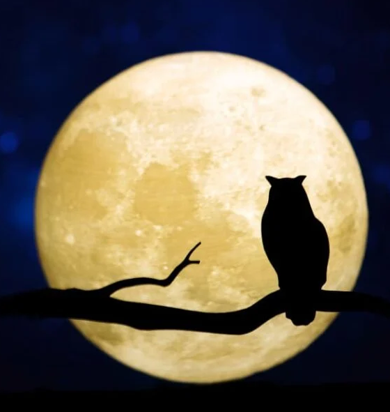
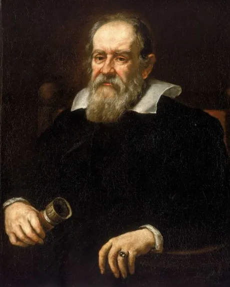

<!-- Adicione Badges das tecnologias que você usou aqui -->
<!-- Você pode encontrar badges aqui: https://github.com/Ileriayo/markdown-badges?tab=readme-ov-file#markdown-badges -->

**Este projeto foi desenvolvido como atividade final do curso de capacitação em Python da Cyber Edux, realizado de setembro de 2023 até março de 2024. Para mais informações, consulte o [enunciado](ENUNCIADO.md).**

# LoginPonto

<!-- Substitua a seguinte imagem por uma logo do seu projeto -->

<!-- Substitua o seguinte parágrafo por um resumo do seu projeto: -->
Este projeto tem por objetivo criar um controle de entrada e saída de Pessoas com usuarios devidamente cadastrados. O controle é realizado após o login, sendo capturada o dia/mês/ano - hora:minuto:segundo da entrada ou saída do usuario, que deve estar logado na internet local.

## Documentação

* [Documentação (para desenvolvedores)](DOCUMENTACAO.md)
* [Manual (para usuários)](MANUAL.md)

## Sobre o autor

<!-- Coloque seu nome, uma foto sua e uma pequena bio sobre você na seguinte tabela: -->
|  |  |
|:-------------:|:------------------------------------------------------------:|
|    **LUCAS G SANTOS** | Uma alma inquieta e apaixonada pela vida. Movido pela curiosidade e pela sede de conhecimento, estou sempre em busca de novas experiências e desafios. Como desenvolvedor, encontro realização na exploração das fronteiras do meu campo e na criação de soluções inovadoras. Minha jornada é moldada pela minha dedicação à excelência e ao crescimento pessoal, sempre buscando superar limites e alcançar novos patamares de realização. Com um coração aberto e mente receptiva, estou pronto para enfrentar os altos e baixos da vida com coragem e determinação. Venha comigo enquanto exploramos juntos as maravilhas do universo e deixamos nossa marca no mundo. |
